# LAB : Nexus Repository Manager
### Étudiant B : Gestion des Artifacts avec Nexus

---

# Objectif du TP

Dans ce laboratoire, j’ai travaillé sur l’outil **Nexus Repository Manager** afin de comprendre la gestion centralisée des artifacts dans une chaîne CI/CD.

L’objectif principal était :

- Installer Nexus
- Créer un repository Maven
- Générer un artifact Java avec Maven
- Déployer l’artifact dans Nexus
- Vérifier le stockage et la gestion des versions

---

# 1. Installation de Nexus avec Docker

Pour éviter la perte des données après suppression du conteneur, j’ai utilisé un volume Docker.

Commande utilisée :

```bash
docker run -d \
--name nexus \
-p 8081:8081 \
-v nexus-data:/nexus-data \
sonatype/nexus3
```
### Capture — Container Nexus:

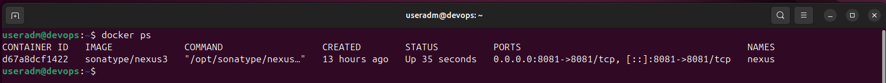

# 2. Accès à Nexus

Après le démarrage du conteneur, j’ai accédé à Nexus via :

```bash
http://localhost:8081
```
Pour récupérer le mot de passe admin :

```bash
docker exec nexus cat /nexus-data/admin.password
```

### Capture — Interface Nexus
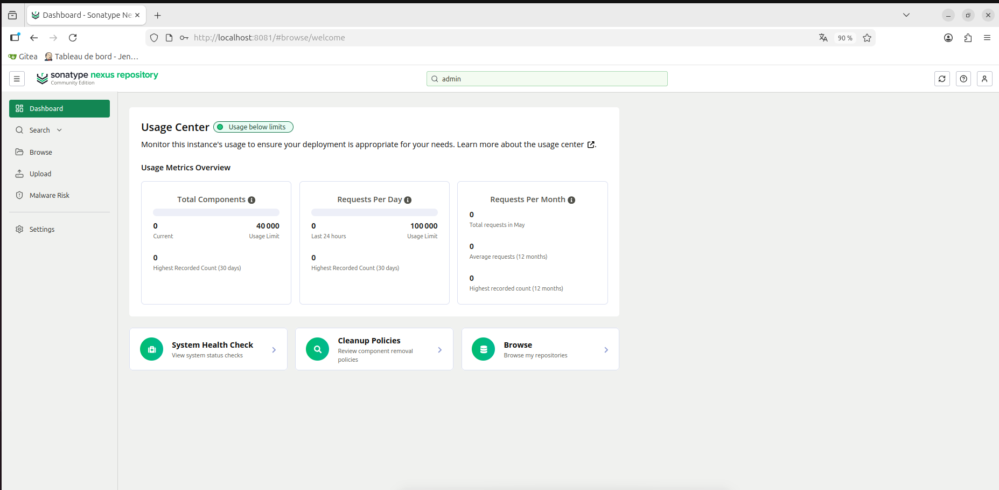

# 3. Création du Repository Maven

J’ai créé un repository Maven de type :

**maven2 (hosted)**
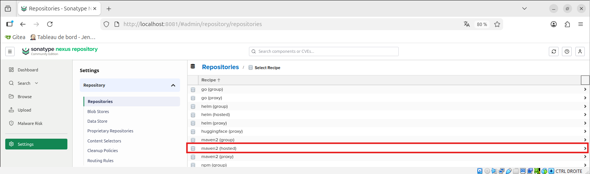

Nom du repository :

**maven-project-repo**
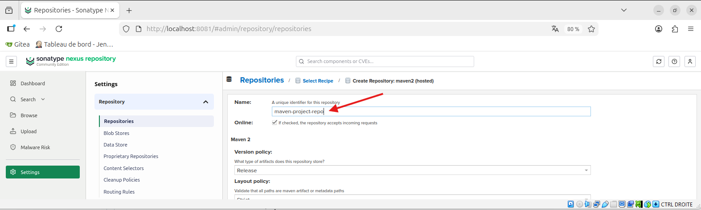

Configuration choisie :
| Paramètre | Valeur |
|---|---|
| Version Policy | Snapshot |
| Deployment Policy | Allow redeploy |

Cette configuration permet de stocker les versions de développement (SNAPSHOT).

### Capture — Configuration du Repository
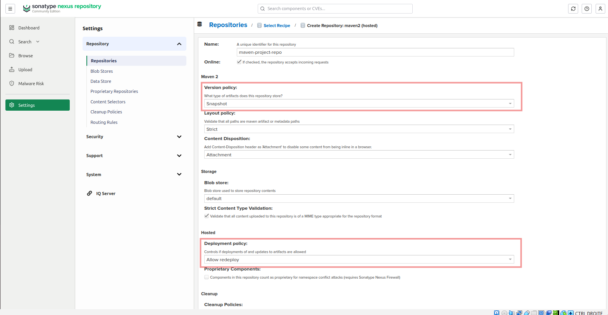

# 4. Génération du projet Spring Boot

Pour créer le projet Java Maven, j’ai utilisé le site :

https://start.spring.io/

### Configuration choisie :
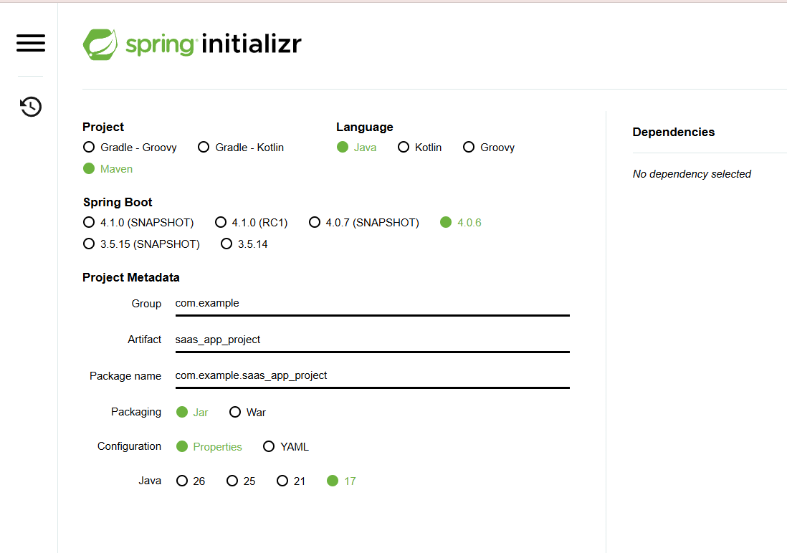

### Compilation du projet :
```bash
mvn clean package
```
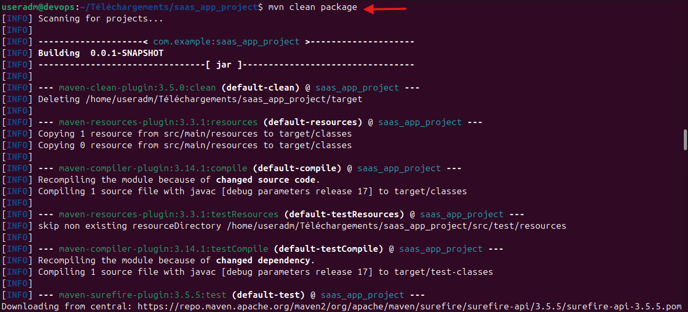

###  Capture — BUILD SUCCESS

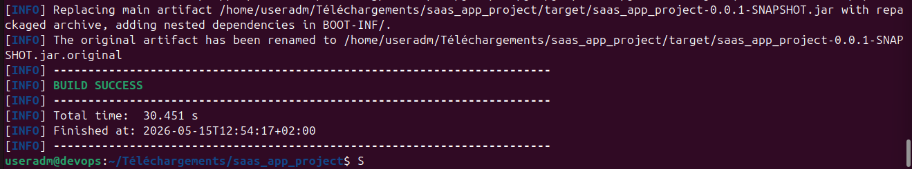

Résultat obtenu :

### target/*.jar
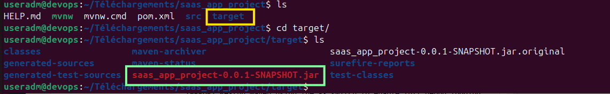

Le fichier JAR représente l’artifact généré par Maven.


# 5. Configuration du fichier pom.xml

Ajout de la configuration Nexus dans le fichier pom.xml :


```bash
<distributionManagement>
    <snapshotRepository>
        <id>nexus</id>
        <url>
            http://localhost:8081/repository/maven-project-repo/
        </url>
    </snapshotRepository>
</distributionManagement>
```
Cette configuration permet à Maven d’envoyer automatiquement les artifacts vers Nexus.

# 6. Configuration du fichier settings.xml

Modification du fichier :
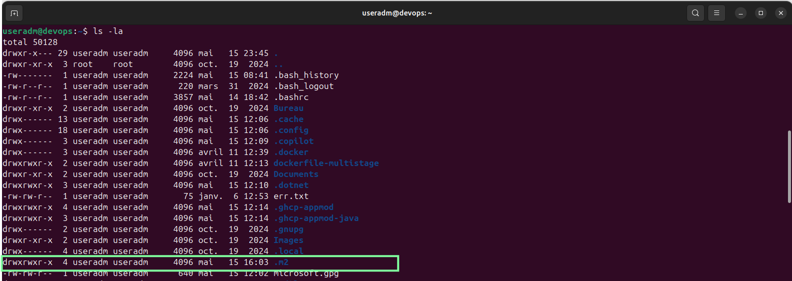

```bash
~/.m2/settings.xml
```

Ajout des credentials Nexus :
```
<settings>
  <servers>
    <server>
      <id>nexus</id>
      <username>admin</username>
      <password>********</password>
    </server>
  </servers>
</settings>
```
# 7. Déploiement de l’artifact dans Nexus

Commande utilisée :

```bash
mvn clean deploy
```
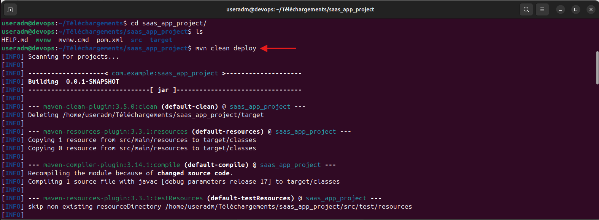

Résultat :

**BUILD SUCCESS**
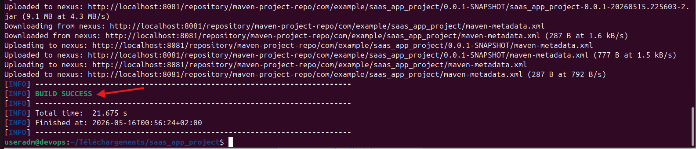

L’artifact a été envoyé avec succès vers le repository Nexus.


# 8. Vérification dans Nexus

Dans la section :
```bash
Browse → maven-project-repo
```
J’ai retrouvé les fichiers suivants :

.jar
.pom
maven-metadata.xml
.sha1
.md5

Cela confirme le bon fonctionnement du déploiement Maven vers Nexus.

### Capture — Artifact dans Nexus
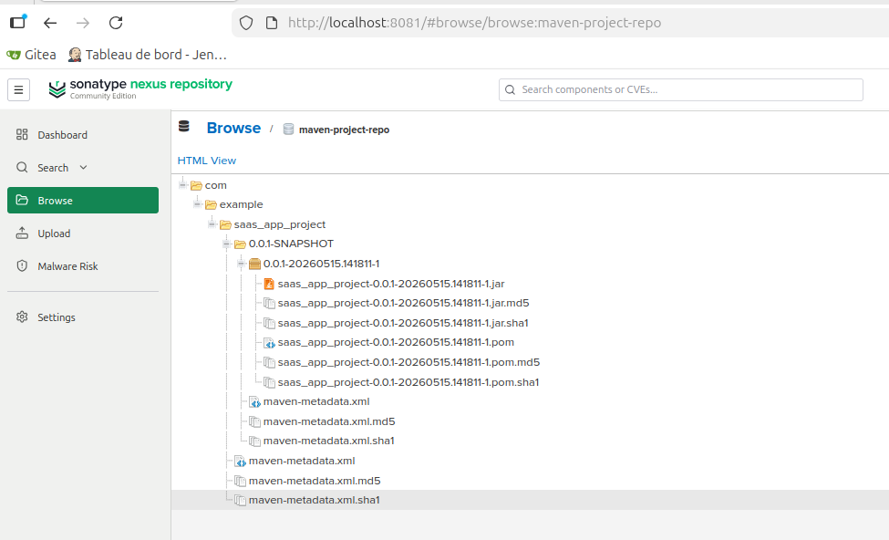

# 9. Test manuel du Hosted Repository

En plus du déploiement Maven automatique, j’ai également testé l’upload manuel d’un fichier dans Nexus.

Pour cela, j’ai utilisé le repository :

```text
maven-project-repos
```

Puis j’ai utilisé l’option :

```text
Upload
```

dans l’interface Nexus afin d’ajouter manuellement un fichier artifact.

Cette méthode permet d’ajouter des artifacts sans utiliser Maven.

---

### Capture — Upload manuel dans Nexus

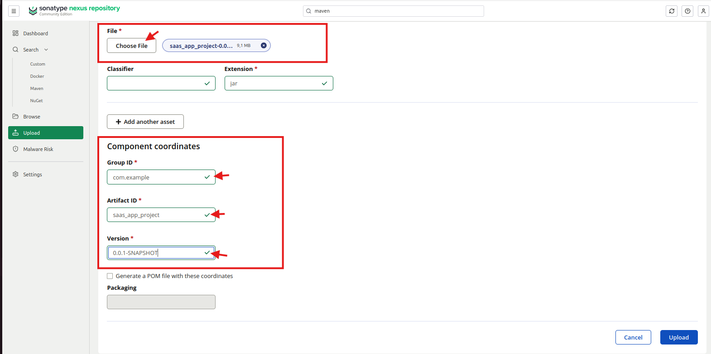

---

# 10. Test du Proxy Repository

J’ai aussi exploré le fonctionnement des repositories de type Proxy.
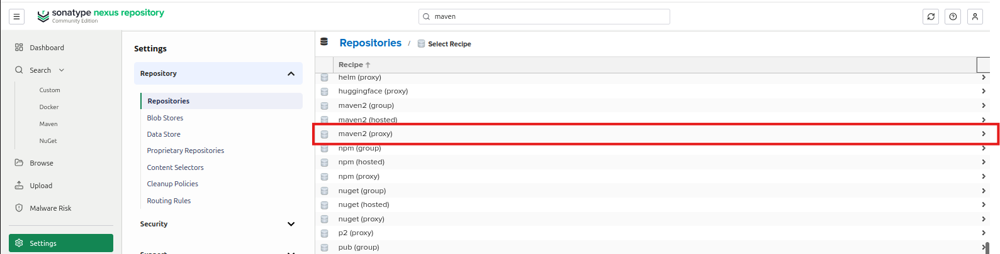
Un Proxy Repository permet à Nexus de récupérer et mettre en cache les dépendances provenant d’un repository distant comme Maven Central.

Exemple :

```text
maven-central-proxy
```

Avantages :

- Réduction du temps de téléchargement
- Mise en cache locale
- Accès centralisé aux dépendances
- Amélioration des performances CI/CD

---

### Capture — Proxy Repository

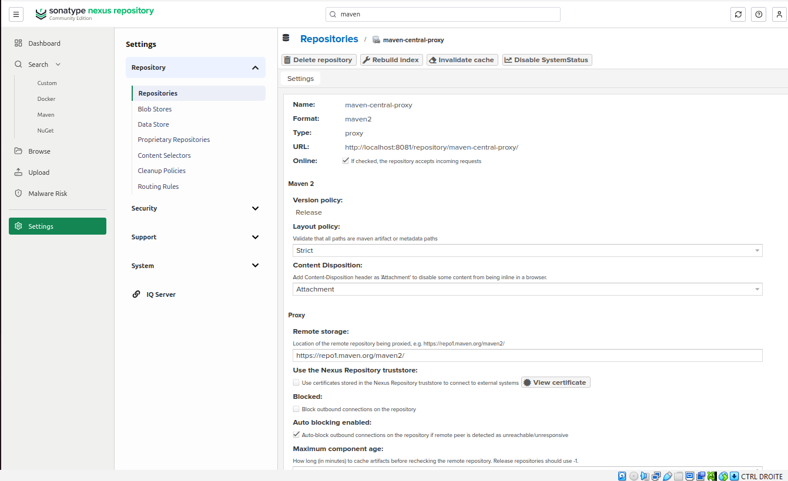


---

# 11. Test du Group Repository

Enfin, j’ai testé les Group Repositories.
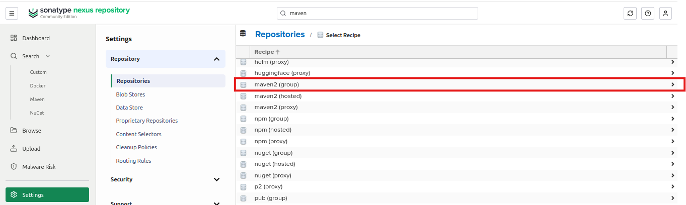

Un Group Repository permet de regrouper plusieurs repositories dans une seule URL.

Exemple :

- Hosted repositories
- Proxy repositories
- Snapshot repositories

Cela simplifie l’utilisation des repositories dans Maven.

Exemple de group repository :

```text
maven-public-group
```

Le développeur peut utiliser une seule URL Maven au lieu de plusieurs repositories différents.

---

### Capture — Group Repository

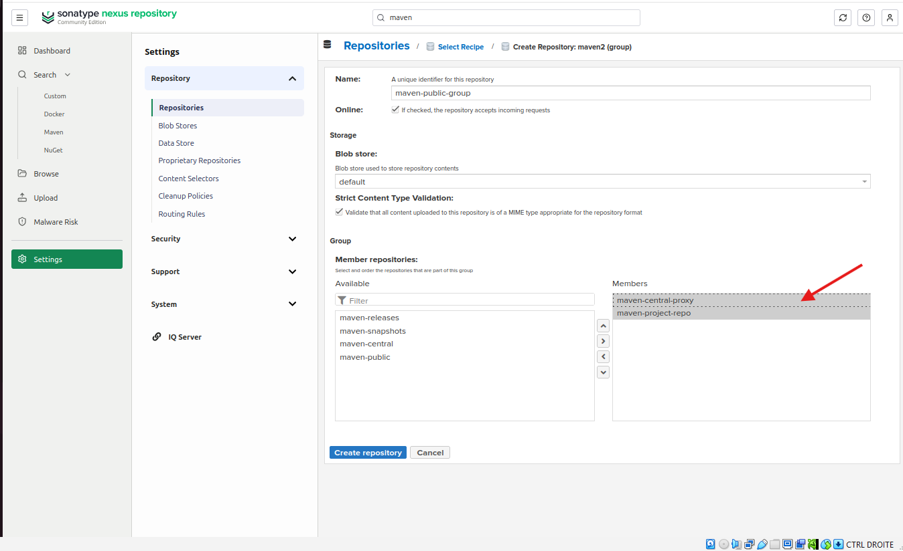


---

# 📚 Types de repositories étudiés

| Type | Rôle |
|---|---|
| Hosted | Stockage des artifacts internes |
| Proxy | Cache des repositories distants |
| Group | Regroupement de plusieurs repositories |

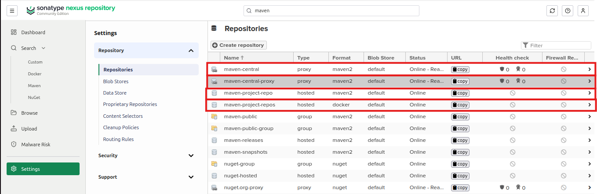

---

# ✅ Conclusion générale

Ce laboratoire m’a permis de comprendre le rôle de Nexus dans une chaîne CI/CD moderne.

J’ai appris à :

- Installer Nexus avec Docker
- Utiliser les volumes Docker pour la persistance
- Créer des repositories Maven
- Déployer des artifacts avec Maven
- Utiliser les repositories Hosted, Proxy et Group
- Comprendre la gestion des versions SNAPSHOT
- Centraliser et gérer les artifacts d’une application

Cette expérience m’a permis de mieux comprendre la gestion des artifacts dans les environnements DevOps et CI/CD.


