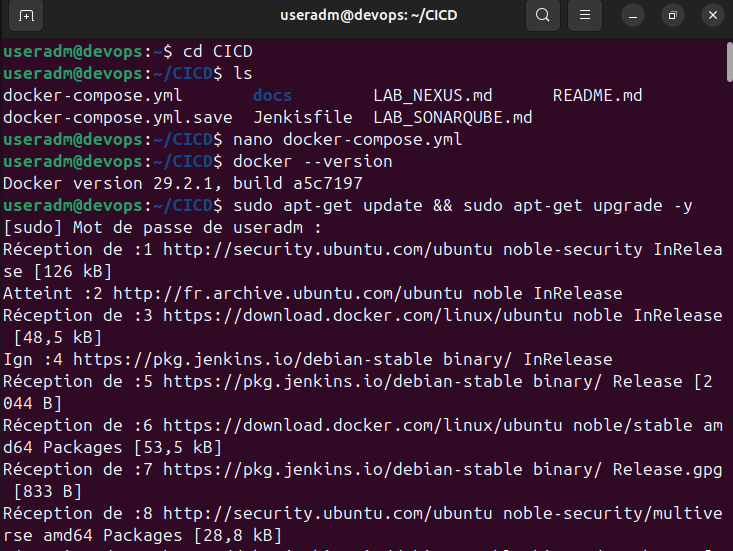
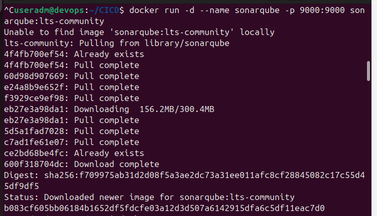
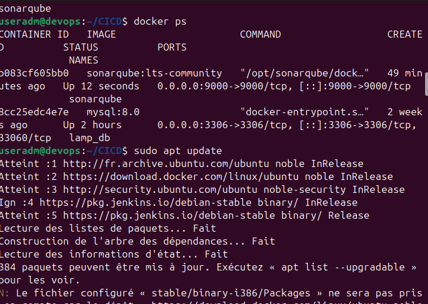
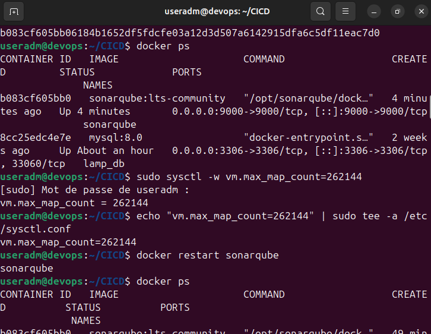
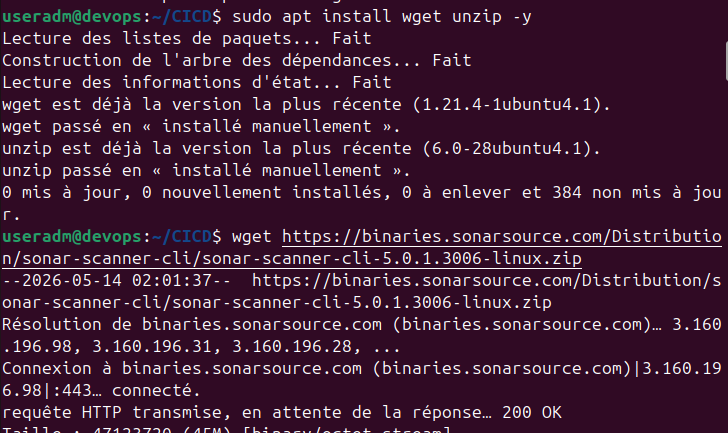
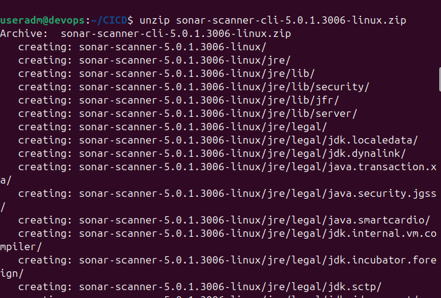
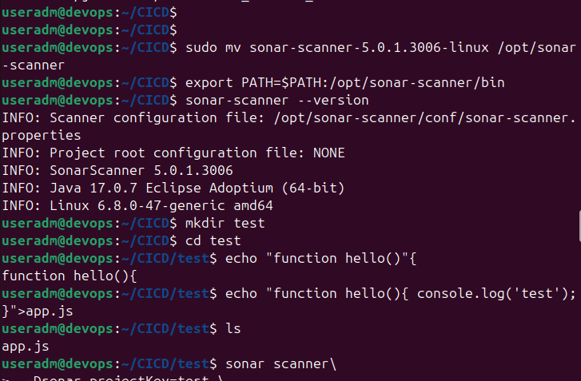
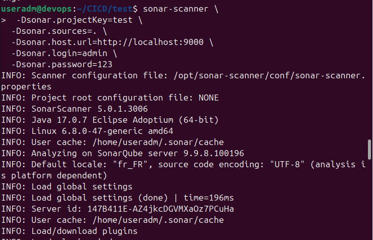

# Installation du Sonarqube (Analyse de Qualité du Code)

SonarQube est une plateforme d’analyse de qualité du code permettant de détecter : Les bugs, les vulnérabilités de sécurité
- Les mauvaises pratiques de développement
- La dette technique

# Besoin Métier

Dans les projets professionnels, un mauvais code peut provoquer :

- Des erreurs critiques
- Des failles de sécurité
- Une maintenance difficile
- Une baisse de performance

L’objectif est d’améliorer :
- La qualité du code
- La sécurité des applications
- La maintenabilité des projets

SonarQube permet aux équipes de développement de vérifier automatiquement la qualité du code source avant le déploiement.

# Test et Validation
1. update system et verify Docker version


2. Start Sonarqube container
```bash
  docker run -d --name sonarqube -p 9000:9000 sonarqube:lts-community
```


Sonarqube localhost url
```bash
  http://localhost:9000
  ```

  ```

3. Verify Sonarqube is running
```bash
  docker ps
```


4. Configure vm.max_map_count
==>This changes a Linux kernel parameter required by SonarQube because SonarQube uses Elasticsearch internally.
```bash
  sudo sysctl -w vm.max_map_count=262144
```


Make the setting permanent
```bash
  echo "vm.max_map_count=262144" | sudo tee -a /etc/sysctl.conf
```


Restart SonarQube
```bash
  docker restart sonarqube
```

5. Install wget and unzip
==>This installs tools needed to download and extract SonarScanner.
```bash
  sudo apt install wget unzip -y
```


6. Download SonarScanner CLI
==> SonarScanner is the tool that scans the source code and sends the analysis result to SonarQube.
```bash
  wget https://binaries.sonarsource.com/Distribution/sonar-scanner-cli/sonar-scanner-cli-5.0.1.3006-linux.zip
```


7. Extract SonarScanner
```bash
   unzip sonar-scanner-cli-5.0.1.3006-linux.zip
```


8. Move SonarScanner to /opt
```bash
   sudo mv sonar-scanner-5.0.1.3006-linux /opt/sonar-scanner
```


9. Add SonarScanner to the PATH
```bash
   export PATH=$PATH:/opt/sonar-scanner/bin
```


10. Create a test project folder
```bash
   mkdir test
   cd test
```


11. Create app.js
```bash
   echo "function hello(){ console.log('test'); }" > app.js
```


12. Run SonarScanner with project settings and login
```bash
   sonar-scanner \
    -Dsonar.projectKey=sonarqube \
    -Dsonar.sources=. \
    -Dsonar.host.url=http://localhost:9000 \
    -Dsonar.login=admin \
    -Dsonar.password=123
```



