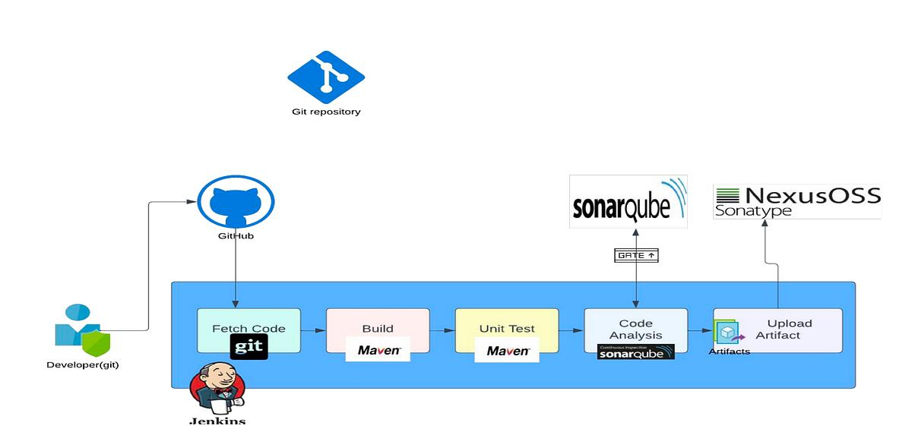

# Construction d'une Chaîne CI/CD Sécurisée

## Présentation du Projet
L'objectif de ce dossier est de mettre en place une plateforme d'intégration continue professionnelle. Vous allez transformer un simple build Jenkins en un pipeline robuste incluant l'analyse de la qualité du code (SonarQube) et la gestion des artéfacts (Nexus).

- SonarQube pour l’analyse de qualité et de sécurité du code
- Nexus Repository Manager pour la gestion des artéfacts

# Membres du Binôme
| Étudiant | Rôle |
|----------|------|
| Fatma Bessad | Expert SonarQube |
| Rayen Marzouk| Expert Nexus |




---

## Architecture globale

```
┌─────────────────────────────────────────────────────────────────────────────┐
│                        Chaîne CI/CD Complète                                 │
│                                                                               │
│                                                                               │
│   Developer          Git Repo          Jenkins           SonarQube            │
│      │                  │                 │                  │                │
│      │── git push ──────►│                 │                  │                │
│      │                  │── webhook ──────►│                  │                │
│      │                  │                 │                  │                │
│      │                  │           ┌─────▼──────────────┐   │                │
│      │                  │           │  Stage: Checkout   │   │                │
│      │                  │           └─────┬──────────────┘   │                │
│      │                  │                 │                  │                │
│      │                  │           ┌─────▼──────────────┐   │                │
│      │                  │           │  Stage: Build      │◄──┼── Nexus Proxy  │
│      │                  │           │  (mvn package)     │   │   (dépendances)│
│      │                  │           └─────┬──────────────┘   │                │
│      │                  │                 │                  │                │
│      │                  │           ┌─────▼──────────────┐   │                │
│      │                  │           │  Stage: Tests      │   │                │
│      │                  │           │  (JUnit + JaCoCo)  │   │                │
│      │                  │           └─────┬──────────────┘   │                │
│      │                  │                 │                  │                │
│      │                  │           ┌─────▼──────────────┐   │                │
│      │                  │           │  Stage: SonarQube  ├───►  Analysis +    │
│      │                  │           │  Analysis          │   │  Quality Gate   │
│      │                  │           └─────┬──────────────┘   │                │
│      │                  │                 │◄─── PASS / FAIL ──┘                │
│      │                  │                 │                                    │
│      │                  │         FAIL ───┤                                    │
│      │◄──── Notif ───────────────────────┤                                    │
│      │      (pipeline bloqué)            │                                    │
│      │                  │               PASS                                   │
│      │                  │           ┌────▼───────────────┐                    │
│      │                  │           │  Stage: Deploy     │                    │
│      │                  │           │  to Nexus          ├──────────────────► Nexus
│      │                  │           │  (mvn deploy)      │                   Hosted
│      │                  │           └────────────────────┘                    │
└─────────────────────────────────────────────────────────────────────────────┘
```


---

## Stack technologique

| Outil | Rôle | Version | Port |
|-------|------|---------|------|
| **Jenkins** | Orchestrateur CI/CD — exécute le pipeline | LTS | `8080` |
| **SonarQube** | Analyse qualité & sécurité du code | 10.x Community | `9000` |
| **Nexus Repository Manager** | Stockage et gestion des artifacts | 3.x OSS | `8081` |
| **PostgreSQL** | Base de données de SonarQube | 15 | `5432` |
| **Maven** | Build tool du projet Java | 3.9 | — |
| **Docker / Docker Compose** | Conteneurisation de toute la stack | Latest | — |
| **Spring Boot** | Application Java de démonstration | 3.x | — |

---


# Objectifs du Projet
Le projet a pour but de :

- Comprendre l’architecture d’une chaîne CI/CD
- Installer des outils DevOps avec Docker
- Réaliser des tests indépendants des outils
- Comprendre l’analyse de qualité du code
- Comprendre la gestion des artéfacts
- Préparer l’intégration avec Jenkins

---

## Résultats & Validation

### Semaine 1 — Installation et tests isolés

| Outil | Critère | Statut |
|-------|---------|--------|
| Nexus | Conteneur démarré avec volume persistant | ✅ |
| Nexus | Interface accessible sur port 8081 | ✅ |
| Nexus | Repository `maven-project-repo` créé (Hosted, Snapshot) | ✅ |
| Nexus | Artifact Spring Boot déployé via `mvn deploy` | ✅ |
| Nexus | Fichiers `.jar`, `.pom`, `.sha1`, `maven-metadata.xml` présents | ✅ |
| Nexus | Test upload manuel dans l'interface Nexus | ✅ |
| Nexus | Proxy Repository configuré (cache Maven Central) | ✅ |
| Nexus | Group Repository configuré (URL unique) | ✅ |
| SonarQube | Conteneur démarré avec PostgreSQL | ✅ |
| SonarQube | Interface accessible sur port 9000 | ✅ |
| SonarQube | Projet Spring Boot analysé | ✅ |
| SonarQube | Quality Gate configuré et actif | ✅ |

### Semaine 2 — Pipeline intégré

| Critère | Comportement attendu | Statut |
|---------|---------------------|--------|
| Pipeline complet | Jenkins orchestre build → test → analyse → déploiement | ✅ |
| Échec sur mauvais code | Quality Gate Failed → pipeline s'arrête, Nexus non alimenté | ✅ |
| Succès sur bon code | Quality Gate Passed → artifact publié dans Nexus | ✅ |
| Communication Jenkins ↔ SonarQube | Token SonarQube configuré dans Jenkins | ✅ |
| Communication Jenkins ↔ Nexus | Credentials Maven dans `settings.xml` et Jenkins | ✅ |

---
